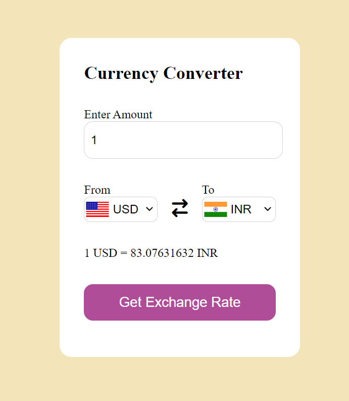

# Currency Converter

This Currency Converter is a web application that allows users to convert between different currencies using real-time exchange rates. It is built with HTML, CSS, and JavaScript and utilizes a currency API to fetch the latest exchange rates.

## Features

- **Real-time Conversion:** Fetches the latest exchange rates from an API to ensure accurate currency conversion.
- **User-Friendly Interface:** Simple and intuitive interface for users to input the amount and select currencies for conversion.
- **Responsive Design:** Ensures compatibility and usability across various devices and screen sizes.

## Demo

You can see a live demo of the Currency Converter [here](#) (replace with the link to your deployed application).

## Screenshots



## Usage

To use the Currency Converter, follow these steps:

1. Clone the repository:

    ```bash
    git clone https://github.com/your-username/currency-converter.git
    ```

2. Open `index.html` in your preferred web browser.

3. Enter the amount you want to convert and select the currencies you are converting from and to.

4. Click on the "Get Exchange rate" button to see the converted amount.

## Contributing

Contributions are welcome! If you have any suggestions, enhancements, or bug fixes, please open an issue or create a pull request.


